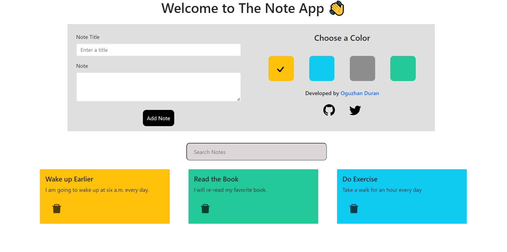

<div align="center">
  <h1> Note App </h1>
</div>

<div>

  <p align="center">
    The application provides adding and deleting your notes together with a selected background color.
    <br />
    <br />
    <a href="https://oguzhan-duran-redux-note-app.netlify.app/" target="_blank">↪️ See it live!</a>
  </p>
</div>

<div align="center">
  
</div>

<!-- ABOUT THE PROJECT -->

### 💻 Built With

- [React.js](https://reactjs.org/)
- [Redux](https://redux.js.org/)
- [React-Bootstrap](https://react-bootstrap.github.io/)

<!-- SETUP -->

## ⚙️ Setup

- In the project directory, ou can follow the steps below to download the dependencies:
  - Install with npm:
  ```sh
  npm i
  ```
  - Install with yarn:
  ```sh
  yarn install
  ```
- In the project directory, you can run:
  - Run with npm:
  ```sh
  npm start
  ```
  - Run with yarn:
  ```sh
  yarn start
  ```

## ⌨️ Usage

You need to enter a title and content to create a note.

## 📧 Contact

Oguzhan Duran - [Linkedin](https://www.linkedin.com/in/oguzhnduran/) - [Twitter](https://twitter.com/oguzhnduran)- oguzhnduran@gmail.com

<!-- SHOW YOUR SUPPORT -->

## ⭐️ Show Your Support

Please give a ⭐️ if this project helped you!
